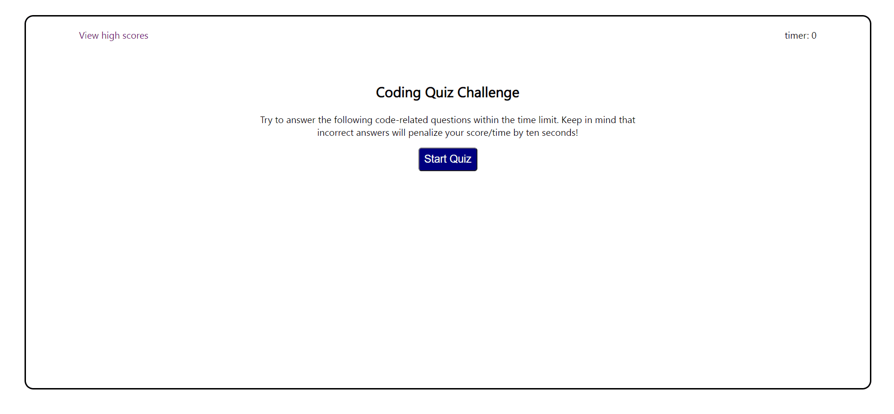

# ch4-coding-quiz
 

## **Link** to web application:  

## **Link** to project repository: https://github.com/alinz07/ch4-coding-quiz 
 

## **Purpose**
Build a timed coding quiz with multiple-choice questions. This app will run in the browser, and will feature dynamically updated HTML and CSS powered by JavaScript code.

 

## **Challenge Criteria**
AS A coding boot camp student
I WANT to take a timed quiz on JavaScript fundamentals that stores high scores
SO THAT I can gauge my progress compared to my peers

GIVEN I am taking a code quiz 

* WHEN I click the start button
  
 THEN a timer starts and I am presented with a question

* WHEN I answer a question 
THEN I am presented with another question

* WHEN I answer a question incorrectly 
THEN time is subtracted from the clock

* WHEN all questions are answered or the timer reaches 0 
THEN the game is over

* WHEN the game is over 
THEN I can save my initials and score

 

## **How and Why**
I had to split this up into many different functions because a lot of code was repeated. I used javascript, instead of jquery, to dynamically create and manipulate the html because this module focused on javascript methods.
 
 

## **Things I learned**
* I learned that jquery could've made this code a lot shorter, but wanted to use only the lessons we learned in this module.

* I practiced dynamically creating html elements, using event listeneres and explored accessing object properties.
 
 

## **What makes this project stand out?**
I most proud of the javascript function comments and order
 
 
# Screenshot of web application

 
 

### **Credits**
* none

